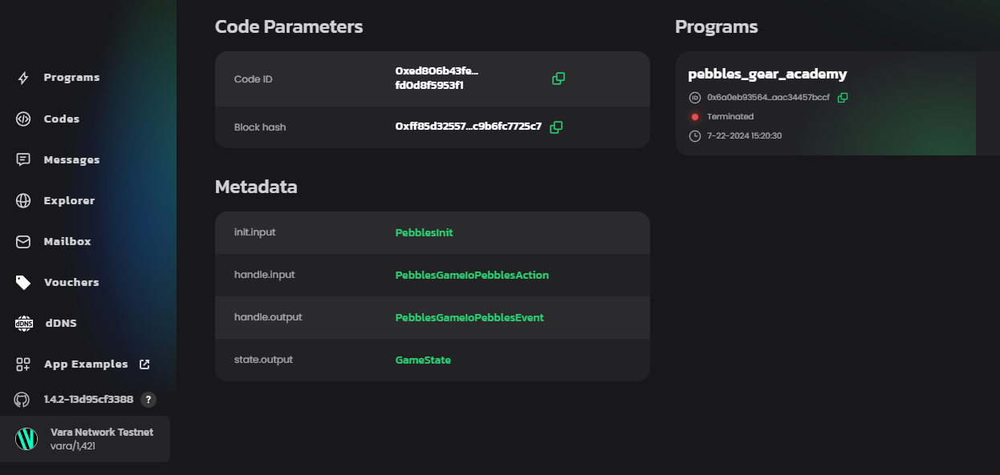

# 任务描述

在这个作业中，需要编写一个名为 Pebbles Game 的游戏。游戏的规则如下：

- 有两个玩家：用户和程序。第一个玩家是随机选择的。

- 游戏开始时有 N 个 pebbles（例如 N=15）。

- 每个玩家的回合中，他们必须从 1 到 K 个 pebbles 中移除（例如，如果 K=2，那么玩家每回合可以移除 1 或 2 个 pebbles）。

- 拿走最后一个 pebble 的玩家获胜。

# 项目结构

需要创建两个 crate：`pebbles-game` 用于程序逻辑，`pebbles-game-io` 用于数据结构。

目录结构应如下所示：


```md
pebbles-game
    ├── io
    │   ├── src
    │   │   └── lib.rs
    │   └── Cargo.toml
    ├── src
    │   └── lib.rs
    ├── tests
    │   └── basic.rs
    ├── Cargo.lock
    ├── Cargo.toml
    └── build.rs
```

# 类型定义

`pebbles-game-io` 将包含输入、输出和内部状态数据的类型定义。

https://idea.gear-tech.io/code/0xed806b43fe1ed55b4db4fd3cf1eacdae8ca7139497868aaaf906fd0d8f5953f1?node=wss%3A%2F%2Ftestnet.vara.network


